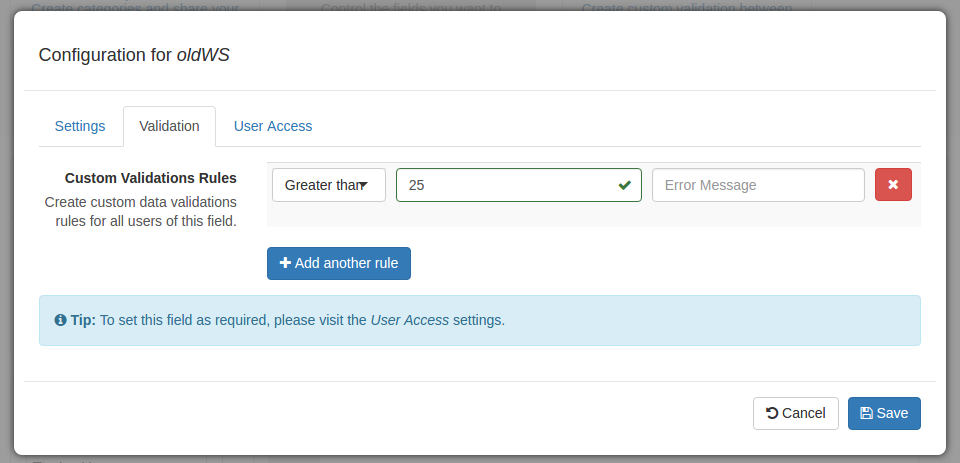
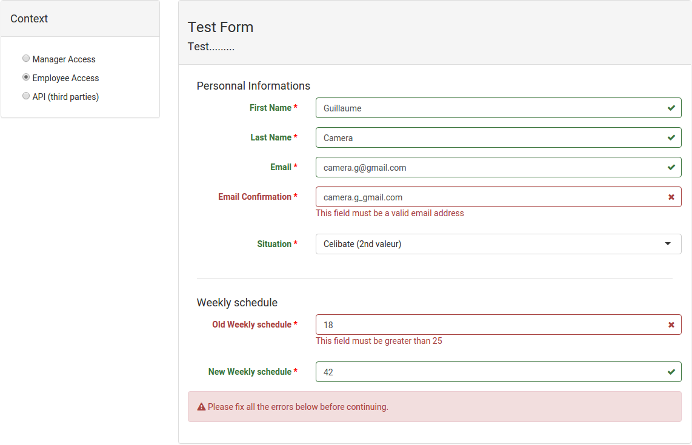

name: title
layout: true
class: template-base, template-title, template-logo-big

---
name: transition
layout: true
class: template-base, template-title, template-logo

---
name: slide
layout: true
class: template-base, template-slide, template-logo

---
template: title
class: template-title-forms

# Projet Formidable
## Django && EmberJS

**Guillaume Camera**
<br/>
 @moumoutt3
<br/>
 camera.g@gmail.com

**Guillaume Gérard**
<br/>
 @ggerard88
<br/>
 guillaume.gerard88@gmail.com

---
template: slide

# Contexte

- ### PeopleDoc est un éditieur de logiciel R.H.

--

- ### PeopleAsk, un produit de ticketing

--

- ### Permet à un employé de remplir des formulaires spécifiques (mais pas seulement)

--

- ### Laisser le soin au client de générer ses propres formulaires spécifiques à son métier sans devoir repasser par la case R&D

---
template: transition
class: template-title-transition

# django-formidable
## Des poneys dans tout leurs états

---
template: slide

# Pourquoi django-formidable ?

--

- ### Contraintes métier fortes :

    - #### Validations Métier

    - #### Restriction d'accès

    - #### Simplicité d'utilisation (R.H.)

--

- ### L'existant n'est pas complet (Role, ...)

--

- ### Besoin d'intégration (UI, API..) pour **nos** applications


---
template: slide

# django-formidable
## Kézako

- ### Application Django pur

--

- ### Permet de créer, d'éditer, de supprimer et d'utiliser des formulaires

--

- ### Plusieurs points d'entrée (API RESTful et python)

---
template: slide

# django-formidable
## Gestion des accès

- ### Définition des rôles par application

--

- ### Gestion des accès par rôle :

  - #### EDITABLE
  - #### REQUIRED
  - #### READ\_ONLY
  - #### HIDDEN


---
template: slide

# django-formidable
## API RESTful


- #### POST /api/form/builder

```javascript
{
    'label': 'un label',
    'description': 'description',
    'fields': [{
        'type': 'text',
        'slug': 'first_name',
        'help_text':....
        'accesses': {...}
    }]
}
```

---
template: slide

# django-formidable
## API RESTful

- #### PUT /api/form/builder

```javascript
{
    'id': 42,
    'label': 'un label',
    'description': 'description',
    'fields': [{
        'type': 'text',
        'slug': 'first_name',
        'help_text':....
        'accesses': {...}
    }]
}
```

---
template: slide

# django-formidable
## API RESTful

- #### GET /api/form/42?access='padawan'

```javascript
{
    'label': 'un label',
    'description': 'description',
    'fields': [{
        'type': 'text',
        'slug': 'first_name',
        'help_text':....
        'required': true,
    }]
}
```

--

- #### La récupération du contexte est déléguée à l'application cliente.

---
template: slide

# django-formidable
## A la recherche des standards
### Des formulaires Django


```python
    >>> formidable = Formidable.objects.get(pk=42)
    >>> form_class = formidable.get_django_form_class(role='padawan')
    >>> form = form_class(data={'last_name': 'Kenobi'})
    >>> isinstance(form, forms.Form)
    True
    >>> form.is_valid()
    False
    >>> form = form_class(data={'first_name': 'Obiwan', 'last_name': 'Kenobi'})
    >>> form.is_valid()
    True
```

---
template: slide

# django-formidable
## A la recherche des standards
### Des formulaires Django


```python
    {{ form.as_p }}
```


---
template: slide

# django-formidable
## Customisation
### L'usine à champs

<ul class="horizontal">
  <li><h5>Champ django par défaut (CharField, TextField, ...)</h5></li>
  <li><h5>Possibilité d'intégrer et de customiser les champs produits</h5></li>
</ul>

```python
    from formidable.forms import field_builder

    class MyTextFieldBuilder(field_builder.TextFieldBuilder):
        widget_class = B3Textarea


    class MyFormFieldFactory(field_builder.FormFieldFactory):
        field_maps.update({
            'text': MyTextFieldBuilder,
        })

    form_class = formidable.get_django_form_class(field_factory=MyFormFieldFactory)

```

---
template: slide

# django-formidable
## Customisation
### Les validations

<div class="half">
 <ul>
  <li>
    <h3>Validations champ à champ</h3>
    <ul>
      <li><h4>Validateurs django</h4></li>
      <li><h4>Validateurs supplémentaires pour les dates (is_age_under...)</h4></li>
    </ul>
  </li>
 </ul>
</div>
--

<div class="half">
 <ul>
  <li>
    <h3>Validations globales (ou presets)</h3>
    <ul>
      <li><h4>Validations plus complexes (On fournit des validations génériques)</h4></li>
      <li><h4>Écrites en python</h4></li>
      <li><h4>Ajout de validations métier personnalisées</h4></li>
    </ul>
  </li>
 </ul>
</div>

---
template: slide

# django-formidable
## Customisation

```python
    from formidable.forms.validations import Presets, PresetValueArgument, PresetFieldArgument

    class CAC40limitation(Presets):

        slug = 'limitation-gain'
        label = "Limitation du gain total"
        description = "S'assurer que les gains ne sont pas trop élévé"
        message = "salary plus bonus cannot be greater than {limitation}"

        class MetaParameters:
            salary = PresetFieldArgument()
            bonus = PresetFieldArgument()
            limitation = PresetValueArgument()

        def run(self, salary, bonus, limitation):
            return salary + bonus < limitation
```


---
template: transition
class: template-title-bees

# API
## Communication vers le monde


---
template: slide

# API
## Communication vers le monde

- ### Django REST framework
--

- ### Deux cas d'utilisation :

  - #### Création / Edition de formulaires

  - #### Récupération de formulaires selon un contexte

--


---
template: transition
class: template-title-transition

# Formidable-UI
## Une histoire de JS

---
template: slide

# Formidable-UI
## Interfaces

- ### Utilisent l'API

--

- ### Framework EmberJS 

- ### Template Bootstrap3

--

- ### Deux composants:

  - #### Constructeur de formulaire

  - #### Saisie utilisateur

---
template: slide

# Formidable-UI
## Création


---
template: slide

# Formidable-UI
## Création

- ### Barre d'outils (champs)


---
template: slide

# Formidable-UI
## Création

- ### Barre d'outils (champs)

- ### Drag'n'drop

- ### Templates spécifiques

<video src="videos/builder.mp4" class="video-builder" controls>
  Votre navigateur n'est pas compatible avec les vidéos, désolé.
</video>

---
template: slide

# Formidable-UI
## Création

- ### Barre d'outils (champs)

- ### Drag'n'drop

- ### Templates spécifiques

- ### Paramètres :

  - #### Affichage && saisie


---
template: slide

# Formidable-UI
## Création

- ### Barre d'outils (champs)

- ### Drag'n'drop

- ### Templates spécifiques

- ### Paramètres :

  - #### Affichage && saisie

  - #### Validation simple



---
template: slide

# Formidable-UI
## Création

- ### Barre d'outils (champs)

- ### Drag'n'drop

- ### Templates spécifiques

- ### Paramètres :

  - #### Affichage && saisie

  - #### Validation simple

  - #### Accès selon les contextes


---
template: slide

# Formidable-UI
## Validations Globales (Presets)


---
template: slide

# Formidable-UI
## Validations<br/>Globales (Presets)

<div class="half">
  <ul>
    <li><h3>CRUD sur les presets</h3></li>
    <li><h3>Preset => Mini formulaire dynamique</h3></li>
  </ul>
</div>


---
template: slide

# Formidable-UI
## Preview /<br/>Saisie utilisateur


---
template: slide

# Formidable-UI
## Preview / <br/>Saisie utilisateur

<div class="half">
  <ul>
    <li><h3>Affichage selon le contexte</h3></li>
    <li><h3>Validations sur les <br/>champs</h3></li>
    <li><h3>Vérifier que les saisies sont valides</h3></li>
  </ul>
</div>


---
template: slide

# Formidable-UI
## Preview / <br/>Saisie utilisateur

<div class="half">
  <ul>
    <li><h3>Affichage selon le contexte</h3></li>
    <li><h3>Validations sur les <br/>champs</h3></li>
    <li><h3>Vérifier que les saisies sont valides</h3></li>
  </ul>
</div>



---
template: slide

# Formidable-UI
## Intégration

```html
<link rel="stylesheet" href="vendor.css">
<link rel="stylesheet" href="formidable.css">

<script src="vendor.js"></script>
<script src="formidable.js"></script>
```

---
template: slide

# Formidable-UI
## Intégration

```html
<div id="formidable"></div>

<script>
  $(document).ready(function() {
      // Listen the form-is-valid event
      Formidable.on('form-is-valid', function(status) {
        // actions
        console.log(status);
      });
      Formidable.start({
        // options
        component: 'builder',
        namespace: 'api',
        lang: 'fr',
        [ ... ]
      });
  });
</script>
```

---
template: slide

# Voir plus

- ### Warning 
  - #### compat django1.8 , python2.7 => python3.2
  - #### Not Prod-Ready

- ### Open source
  - #### MIT
  - #### <a target="_blank" href=" https://github.com/peopledoc/django-formidable">django-formidable</a>
  - #### <a target="_blank" href=" https://github.com/peopledoc/formidable-ui">formidable-ui</a>

---
template: title
class: template-title-poney, template-logo-big

# Merci à vous !
## Des questions ?

**Guillaume Camera**
<br/>
 @moumoutt3
<br/>
 camera.g@gmail.com

**Guillaume Gérard**
<br/>
 @ggerard88
<br/>
 guillaume.gerard88@gmail.com
