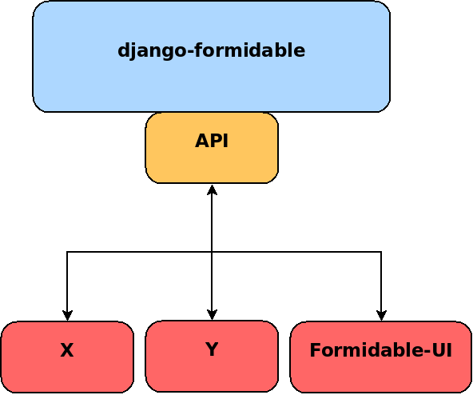
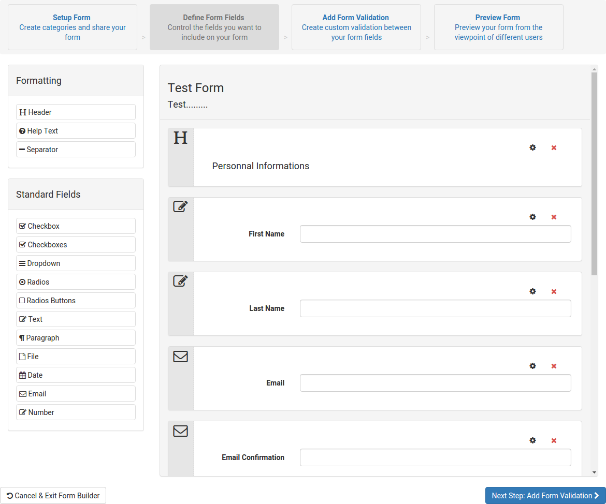
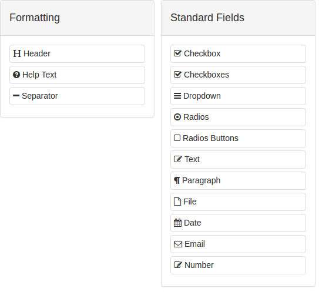
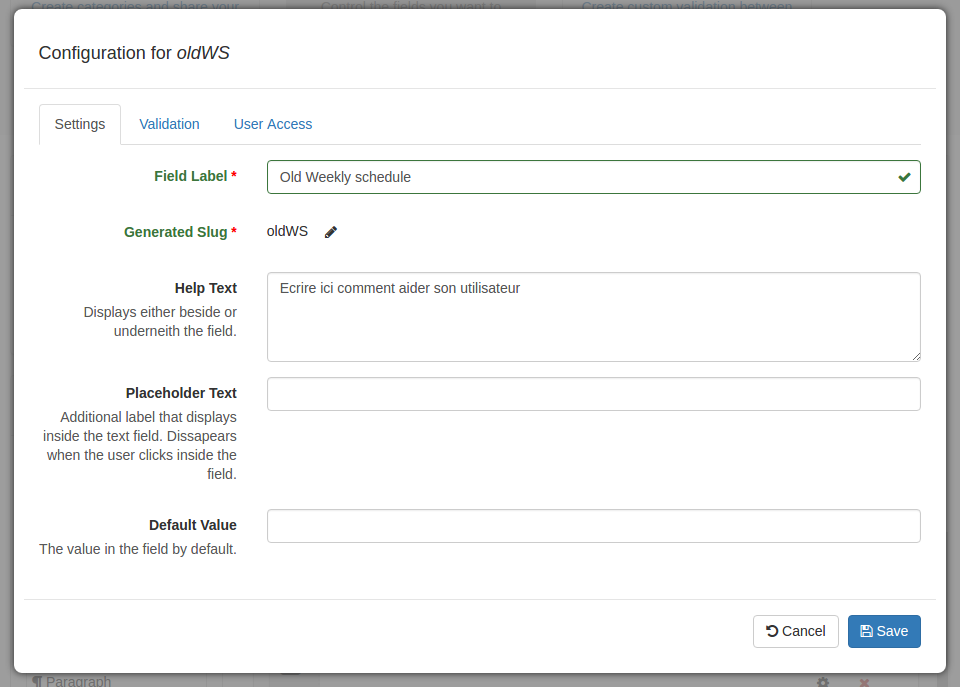
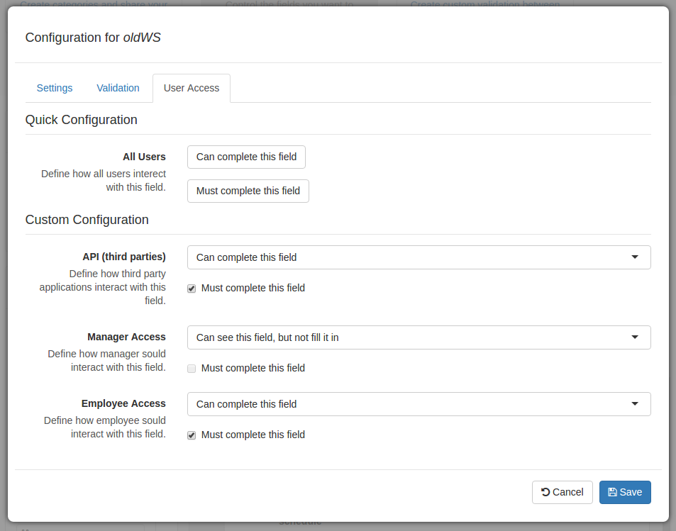
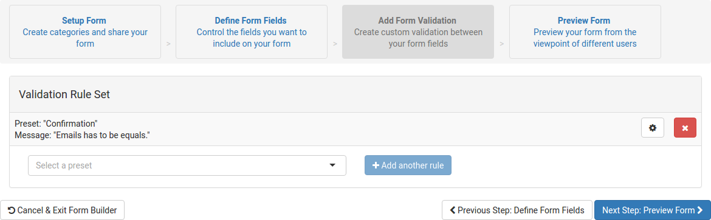
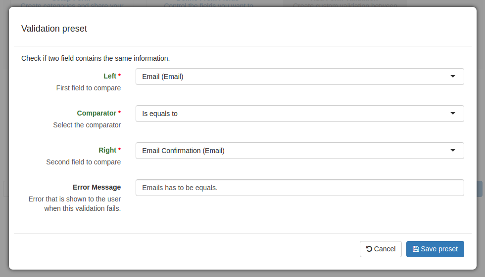
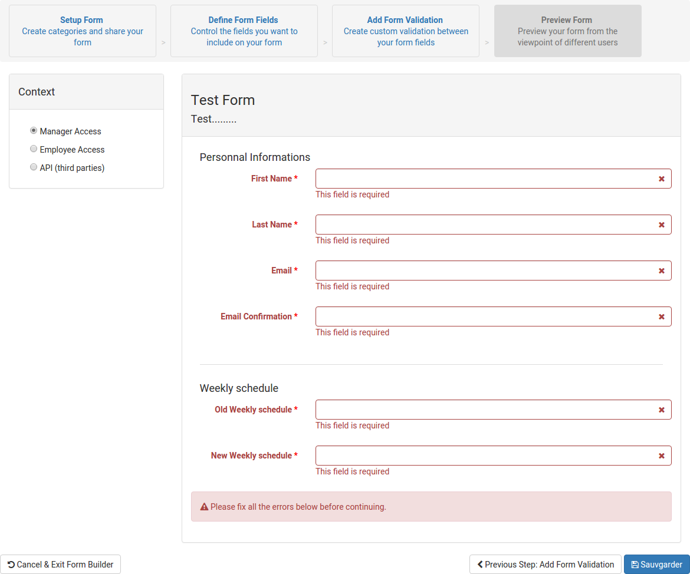
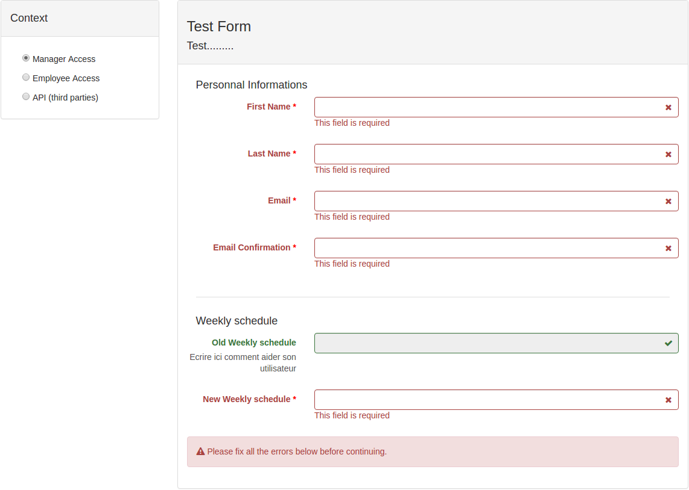
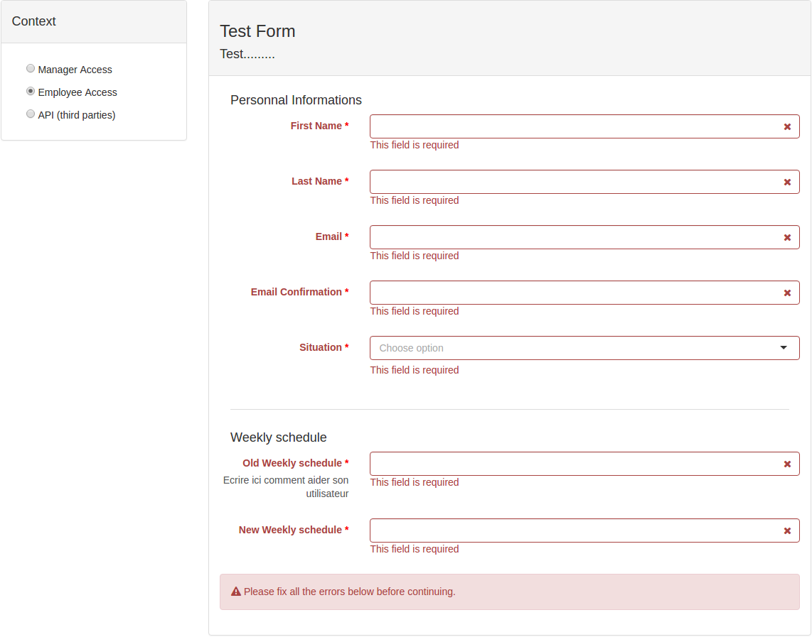

name: title
layout: true
class: template-base, template-title, template-logo-big

---
name: transition
layout: true
class: template-base, template-title, template-logo

---
name: slide
layout: true
class: template-base, template-slide, template-logo

---
template: title
class: template-title-forms

# Projet Formidable
## Django && EmberJS

**Guillaume Camera**
<br/>
 @moumoutt3
<br/>
 camera.g@gmail.com

**Guillaume Gérard**
<br/>
 @ggerard88
<br/>
 guillaume.gerard88@gmail.com

---
template: slide

# Contexte

- ### PeopleDoc est un éditieur de logiciel R.H.

<br/>

--

- ### PeopleAsk, un produit de ticketing

<br/>
--

- ### Permet à un employé de remplir des forms spécifiques (mais pas seulement)

<br/>

--

- ### Laisser la main au client de générer ses propres forms spécifiques à son métier sans devoir repasser par la case R&D.

---
template: transition
class: template-title-transition

# django-formidable
## Des poneys dans tout leurs états

---
template: slide

# Pourquoi django-formidable ?

--

- ### Contraintes métiers fortes

--

    - #### Validations Métiers

    - #### Restriction d'accès

    - #### Simplicité d'utilisation (R.H.)

--

- ### Existant n'est pas complet (Role, ...)

<br/>
--

- ### Besoin d'intégration (UI, API..) pour **nos** applications


---
template: slide

# django-formidable
## Kézako

- ### Application Django pur.

<br/>

--

- ### Permets de créer, d'éditer, de supprimer et d'utiliser des formulaires.

<br/>

--

- ### Plusieurs points d'entrée (API RESTful et python).


---
template: slide

# django-formidable
## Gestions des accès

- ### Définitions des rôles par applications

<br/>
--

- ### Gestion des accès par rôle

  - #### EDITABLE
  - #### REQUIRED
  - #### READ\_ONLY
  - #### HIDDEN


---
template: slide

# django-formidable
## A la recherche des standards
### Des formulaires Django


```python
    >>> formidable = Formidable.objects.get(pk=42)
    >>> form_class = formidable.get_django_form_class(role='padawan')
    >>> form = form_class(data={'last_name': 'Kenobi'})
    >>> isinstance(form, forms.Form)
    True
    >>> form.is_valid()
    False
    >>> form = form_class(data={'first_name': 'Obiwan', 'last_name': 'Kenobi'})
    >>> form.is_valid()
    True
```

---
template: slide

# django-formidable
## A la recherche des standards
### Des formulaires Django


```python
    {{ form.as_p }}
```


---
template: slide

# django-formidable
## Customisation
### L'usine à champs

- Champ django par défaut (CharField, TextField, ...)

- Possibilité d'intégerer de customiser les champs produits

```python
    from formidable.forms import field_builder

    class MyTextFieldFactory(field_builder.TextFieldBuilder):
        widget_class = B3Textarea


    class MyFormFieldFactory(field_builder.FormFieldFactory):
        field_maps.update({
            'text': MyTextFieldFactory,
        })

    form_class = formidable.get_django_form_class(field_factory=MyFormFieldFactory)

```

---
template: slide

# django-formidable
## Customisation
### Les validations

- ### Validations champs à champs

  - #### Validateurs django
  - #### Validateurs supplémentaires pour les dates (is\_age\_under, ...)

<br/>
--

- ### Validations globales, des presets

  - #### Validation plus complexes (Fournit des validations génériques)
  - #### Écrite en python
  - #### Ajout de validations métiers personnalisées

---
template: slide

# django-formidable
## Customisation

```python
    from formidable.forms.validations import Presets, PresetValueArgument, PresetFieldArgument

    class CAC40limitation(Presets):

        slug = 'limitation-gain'
        label = "Limitation du gain total"
        description = "S'assurer que les gains ne sont pas trop élévé"
        message = "salary plus bonus cannot be greater than {limitation}"

        class MetaParameters:
            salary = PresetFieldArgument()
            bonus = PresetFieldArgument()
            limitation = PresetValueArgument()

        def run(self, salary, bonus, limitation):
            return salary + bonus < limitation
```

---
template: slide

# django-formidable
## API Python

- ### Ecrire son objet formidable comme en django

<br/>
--

- ### Utilisation des objets formidables

<br/>
--

- ### Calquer sur les fields django

<br/>
--

- ### Avec les options formidable


---
template: slide


# django-formidable
## API Python


```python

    from formidable.forms import FormidableForm
    from formidable.forms import fields

    class PadawanSubscriptionForm(FormidableForm):

        first_name = fields.CharField(accesses={
            'padawan': 'REQUIRED',
            'jedi': 'READ_ONLY',
        })
        last_name = fields.CharField(
            'padawan': 'REQUIRED',
            'jedi': 'READ_ONLY',
        )
        accepted = fields.BooleanField(
            'padawan': 'HIDDEN',
            'jedi': 'REQUIRED',
        )


```

---
template: slide

# django-formidable
## API Python


```python

    >>> formidable = PadawanSubscriptionForm.to_formidable(label='Subscription Form')
    >>> padawan_form_class = formidable.get_django_form_class(role='padawan')
    >>> 'accepted' in padawan_form_class.declared_fields
    False
    >>> 'first_name' in padawan_form_class.declared_fields
    True
    >>> field = padawan_form_declared_fields['first_name']
    >>> field.required
    True

```

---
template: transition
class: template-title-bees

# API
## Communication vers le monde


---
template: slide

# API
## Communication vers le monde

- ### Django REST framework

<br />
--

- ### Deux cas d'utilisations :

  - ### Création / Edition de formulaire

  - ### Récupération de formulaire selon un contexte

---
template: slide

# API
## Communication vers le monde




---
template: transition
class: template-title-transition

# Formidable-UI
## Une histoire de JS

---
template: slide

# Formidable-UI
## Interfaces

- ### Utilise l'API


<br />
--

- ### Framework EmberJS 

<br />
--

- ### Deux composants: 

  - ### Constructeur de formulaire

  - ### Saisie utilisateur

---
template: slide

# Formidable-UI
## Création



---
template: slide

# Formidable-UI
## Création

- ### Barre d'outils (champs)



---
template: slide

# Formidable-UI
## Création

- ### Barre d'outils (champs)

<br />

- ### Drag'n'drop

- ### Templates spécifiques


---
template: slide

# Formidable-UI
## Création

- ### Barre d'outils (champs)

<br />

- ### Drag'n'drop

- ### Templates spécifiques

<br />

- ### Paramètres :

  - ### Affichage && saisie



---
template: slide

# Formidable-UI
## Création

- ### Barre d'outils (champs)

<br />

- ### Drag'n'drop

- ### Templates spécifiques

<br />

- ### Paramètres :

  - ### Affichage && saisie

  - ### Validation simple


---
template: slide

# Formidable-UI
## Création

- ### Barre d'outils (champs)

<br />

- ### Drag'n'drop

- ### Templates spécifiques

<br />

- ### Paramètres :

  - ### Affichage && saisie

  - ### Validation simple

  - ### Accès selon les contextes



---
template: slide

# Formidable-UI
## Validations Globales (Presets)



---
template: slide

# Formidable-UI
## Validations Globales (Presets)

- ### CRUD sur les presets

- ### Preset => Mini formulaire dynamique





---
template: slide

# Formidable-UI
## Preview / Saisie utilisateur



---
template: slide

# Formidable-UI
## Preview / Saisie utilisateur

- ### Affichage selon le contexte

<br />

- ### Validations sur les champs

<br />

- ### Vérifier que les saisies

### sont valides



---
template: slide

# Formidable-UI
## Preview / Saisie utilisateur

- ### Affichage selon le contexte

<br />

- ### Validations sur les champs

<br />

- ### Vérifier que les saisies

### sont valides



---
template: slide

# Formidable-UI
## Intégration

```html
<link rel="stylesheet" href="vendor.css">
<link rel="stylesheet" href="formidable.css">
<script src="vendor.js"></script>
<script src="formidable.js"></script>

<div id="formidable"></div>

<script>
  $(document).ready(function() {
      Formidable.on('form-is-valid', function(status) {
        // actions
        console.log(status);
      });
      Formidable.start({
        // options
        component: 'builder',
        namespace: 'api',
        lang: 'fr',
        [ ... ]
      });
  });
</script>
```

---
template: slide

# Voir plus

###


### Open source

- ### ...


---
template: title
class: template-title-poney, template-logo-big

# Merci à vous !
## Des questions ?

**Guillaume Camera**
<br/>
 @moumoutt3
<br/>
 camera.g@gmail.com

**Guillaume Gérard**
<br/>
 @ggerard88
<br/>
 guillaume.gerard88@gmail.com
